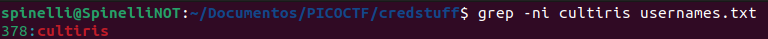

# WriteUP-seguranca
Esse challenge de crypto foi tirado do PICOCTF 2022 e se chamava credstuff.
A descrição é a seguinte:

>We found a leak of a black market website login credentials. Can you find the password of the user ``cultiris`` and successfully decrypt it?
Download the leak here.
The first user in usernames.txt corresponds to the first password int passwords.txt. The second User corresponds to the second password, and so on.

Tradução:
>Encontramos um vazamento de credenciais de login de um site do mercado negro. Você consegue encontrar a senha do usuário ``cultiris`` e descriptografá-la com sucesso?
Baixe o vazamento aqui.
O primeiro usuário em usernames.txt corresponde à primeira senha int passwords.txt. O segundo Usuário corresponde à segunda senha e assim sucessivamente.


A primeira coisa a fazer foi procurar o username ``cultiris`` no arquivo usernames.txt, utilizando o utilitario ```grep```
```shell
grep -ni cultiris usernames.txt
```
E teve como resultado:



Com essa pesquisa, descobrimos que o username ``cultiris`` está na linha 378, e como o enunciado nos informa que a senha correspondente está na mesma linha, só que no arquivo password.txt, basta realizar uma pesquisa no arquivo, procurando especificamente pela linha 378. O comando a awk permite fazer isso:

```shell
awk '{if(NR==378) print $0}' passwords.txt
```
E teve como saída a seguinte senha:


Ou seja, a senha deu: cvpbPGS{P7e1S_54I35_71Z3}, porém, o formato de flag do PICOCTF é: picoCTF{flag}, ou seja, ainda não é a senha esperada, ela está encriptada, agora resta descobrir o tipo.

Olhando um pouco atento, percebe-se que a senha está quase no formato pedido, mas as letras nao estão formando nada com nada. Pesquisando um pouco sobre alguns tipos de criptografias, chegamos na cifra de cesar

A Cifra de César, também conhecida como cifra de troca, código de César ou troca de César, é uma das mais simples e conhecidas técnicas de criptografia. É um tipo de cifra de substituição na qual cada letra do texto é substituída por outra, que se apresenta no alfabeto abaixo dela um número fixo de vezes. Por exemplo, com uma troca de três posições, A seria substituído por D, B se tornaria E, e assim por diante.


Em criptografia, também temos o conceito de criptaritmética, que é trocar letras por números, e é comprovado que o nosso cérebro é capaz de fazer a associação automaticamente e ler textos nesse formato. Para que isso não ocorra, criou-se, com base na cifra de cesar, o ROT13.

ROT-13 (ou rot13, rot-13, Rot13, etc) é o nome que se costuma usar para um procedimento simples mas eficaz para garantir que textos eletrônicos não sejam lidos por distração ou acidente. ROT-13 vem do inglês, ROTate by 13 places, "ROTacionar 13 posições".
